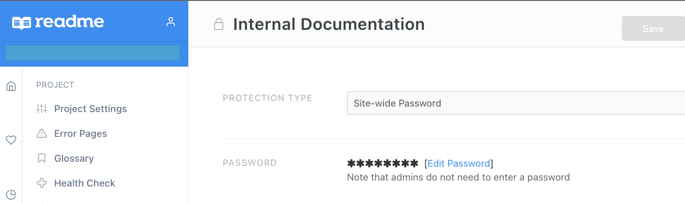

# A very unofficial proxy for your readme.com site project

A simple reverse proxy implemented with Rust, using Tokio Axum, acts as an HTTP proxy to expose your private ReadMe.io project on your own custom domain.

This mean you can protect your ReadMe.io site with a global password while exposing it on your own domain via this proxy!



## Usage

```
docker run --platform linux/amd64 felixgarciaborrego/readme-proxy:0.0.1                
```


## Manually Build

```
docker build --platform linux/amd64 -t felixgarciaborrego/readme-proxy:0.0.1 .
```

## Run it locally

```
export BASE_URL=https://<your_subdomain>.readme.io
export PASSWORD=<your pass>
cargo watch -x run   
```
